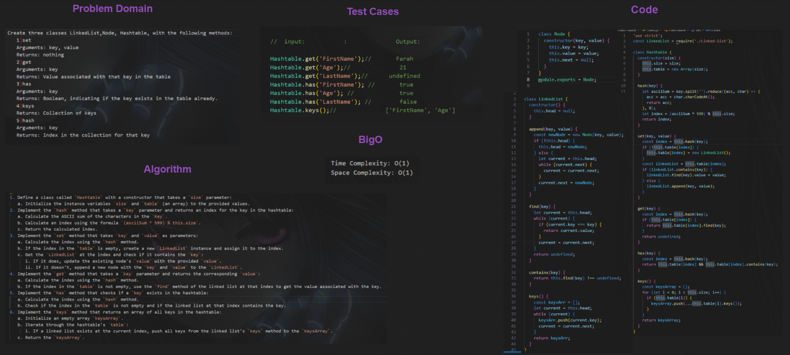
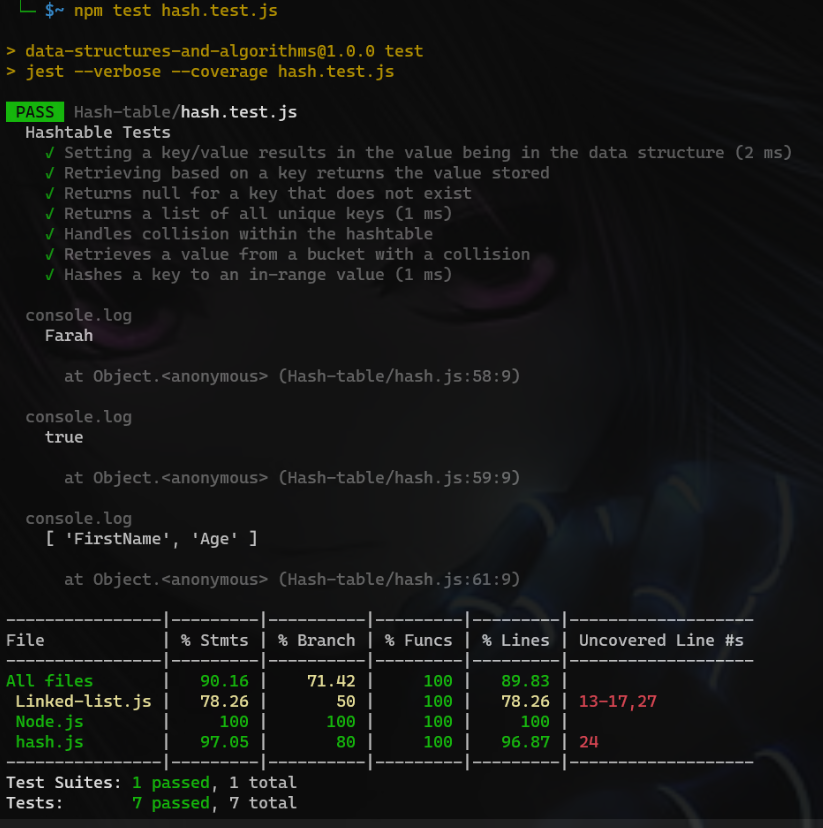

>## Hash Table:
>**Hash table**
A hash table is a data structure that is used to store keys/value pairs. It uses a hash function to compute an index into an array in which an element will be inserted or searched. By using a good hash function, hashing can work well. Under reasonable assumptions, the average time required to search for an element in a hash table is O(1).

> **WhiteBoard**
>

> **Code**
```javascript
class Node {
  constructor(key, value) {
    this.key = key;
    this.value = value;
    this.next = null;
  }
}
class LinkedList {
  constructor() {
    this.head = null;
  }

  append(key, value) {
    const newNode = new Node(key, value);
    if (!this.head) {
      this.head = newNode;
    } else {
      let current = this.head;
      while (current.next) {
        current = current.next;
      }
      current.next = newNode;
    }
  }

  find(key) {
    let current = this.head;
    while (current) {
      if (current.key === key) {
        return current.value;
      }
      current = current.next;
    }
    return undefined;
  }

  contains(key) {
    return this.find(key) !== undefined;
  }

  keys() {
    const keysArr = [];
    let current = this.head;
    while (current) {
      keysArr.push(current.key);
      current = current.next;
    }
    return keysArr;
  }
}
class Hashtable {
  constructor(size) {
    this.size = size;
    this.table = new Array(size);
  }

  hash(key) {
    let asciiSum = key.split('').reduce((acc, char) => {
      acc = acc + char.charCodeAt();
      return acc;
    }, 0);
    let index = (asciiSum * 599) % this.size;
    return index;
  }

  set(key, value) {
    const index = this.hash(key);
    if (!this.table[index]) {
      this.table[index] = new LinkedList();
    }
    const linkedList = this.table[index];
    if (linkedList.contains(key)) {
      linkedList.find(key).value = value;
    } else {
      linkedList.append(key, value);
    }
  }

  get(key) {
    const index = this.hash(key);
    if (this.table[index]) {
      return this.table[index].find(key);
    }
    return undefined;
  }

  has(key) {
    const index = this.hash(key);
    return this.table[index] && this.table[index].contains(key);
  }

  keys() {
    const keysArray = [];
    for (let i = 0; i < this.size; i++) {
      if (this.table[i]) {
        keysArray.push(...this.table[i].keys());
      }
    }
    return keysArray;
  }
}

const myHashtable = new Hashtable(10);
myHashtable.set('FirstName', 'Farah');
myHashtable.set('Age', 21);

console.log(myHashtable.get('FirstName'));
console.log(myHashtable.has('Age'));
//console.log(myHashtable.has('LastName'));
console.log(myHashtable.keys());
module.exports = Hashtable;
```

>**Test:**
>[Hash Test File here](hash.test.js)
> 


