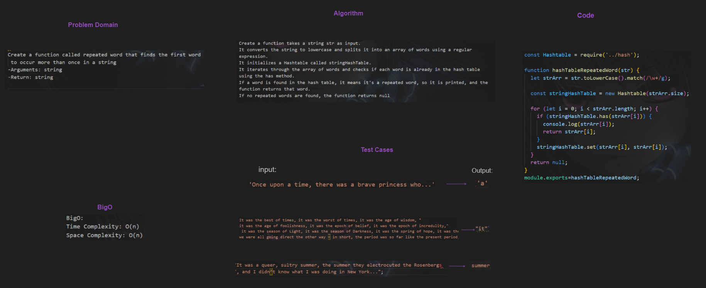
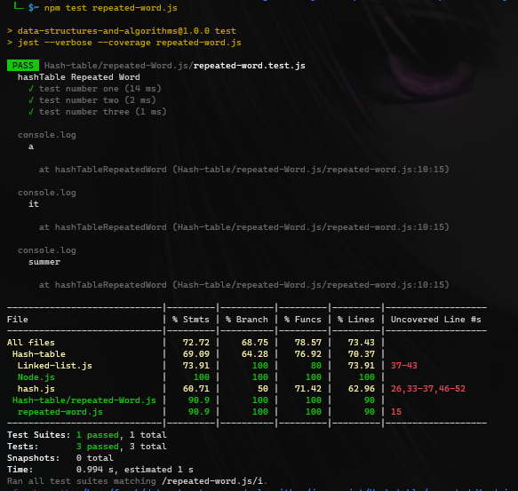

>## Hash Table:


> **WhiteBoard**
>

> **Code**
```javascript
const Hashtable = require('../hash');

function hashTableRepeatedWord(str) {
  let strArr = str.toLowerCase().match(/\w+/g);

  const stringHashTable = new Hashtable(strArr.size);

  for (let i = 0; i < strArr.length; i++) {
    if (stringHashTable.has(strArr[i])) {
      console.log(strArr[i]);
      return strArr[i];
    }
    stringHashTable.set(strArr[i], strArr[i]);
  }
  return null;
}
module.exports=hashTableRepeatedWord;
```

>**Test:**
>[Hash Test File here](repeated-Word.js/repeated-word.test.js)
> 

