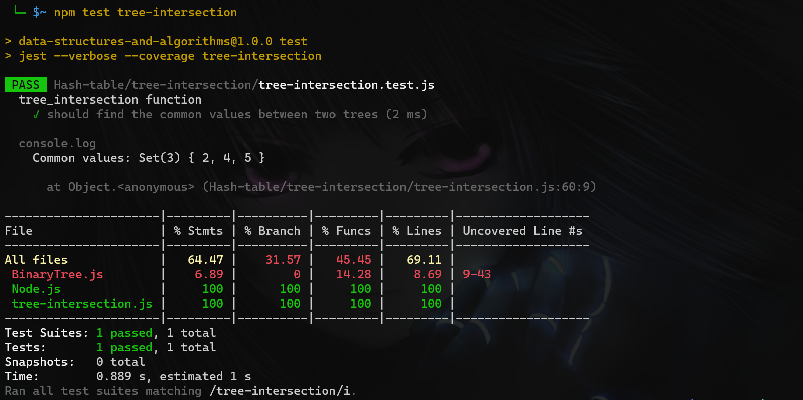

# tree-intersection

>**Whiteboard**
>


>**code**
```javascript
class Node {
  constructor(value) {
    this.value = value;
    this.left = null;
    this.right = null;
  }
}
class BinaryTree{
  constructor(root = null){
    this.root=root;
  }

  // Pre-order: root >> left >> right
  preOrder(){
    let arr=[];
    const traversal= node =>{
      arr.push(node.value);
      if(node.left)traversal(node.left);
      if(node.right)traversal(node.right);
    };

    traversal(this.root);
    return arr;
  }

  // Post-order: left >> right >> root
  postOrder() {
    let arr = [];
    const traversal = node => {
      if(node.left) traversal(node.left);
      if(node.right) traversal(node.right);
      arr.push(node.value);
    };

    traversal(this.root);
    return arr;
  }

  // In-order: left >> root >> right
  inOrder() {
    let arr = [];
    const traversal = node => {
      if(node.left) traversal(node.left);
      arr.push(node.value);
      if(node.right) traversal(node.right);
    };

    traversal(this.root);
    return arr;
  }

}
const node1 = new Node(1);
const node2 = new Node(2);
const node3 = new Node(3);
const node4 = new Node(4);
const node5 = new Node(5);

node1.left = node2;
node1.right = node3;
node2.left = node4;
node2.right = node5;

const tree1 = new BinaryTree(node1);

const node6 = new Node(2);
const node7 = new Node(4);
const node8 = new Node(5);
const node9 = new Node(6);
const node10 = new Node(7);

node6.left = node7;
node6.right = node8;
node7.left = node9;
node7.right = node10;

const tree2 = new BinaryTree(node6);

function treeIntersection(tree1, tree2) {
  const result = new Set();
  const valuesMap = new Map();

  const traverse = (node) => {
    if (!node) return;
    valuesMap.set(node.value, true);
    traverse(node.left);
    traverse(node.right);
  };

  traverse(tree1.root);

  const checkTheCommon = (node) => {
    if (!node) return;
    if (valuesMap.has(node.value)) {
      result.add(node.value);
    }
    checkTheCommon(node.left);
    checkTheCommon(node.right);
  };

  checkTheCommon(tree2.root);

  return result;
}
const commonValues = treeIntersection(tree1, tree2);
//console.log("Tree1", tree1);
//console.log("Tree2", tree2);
console.log('Common values:', commonValues);


```


>
>**Test:** ✔
>[tree-intersection test File here](tree-intersection.test.js)
>


