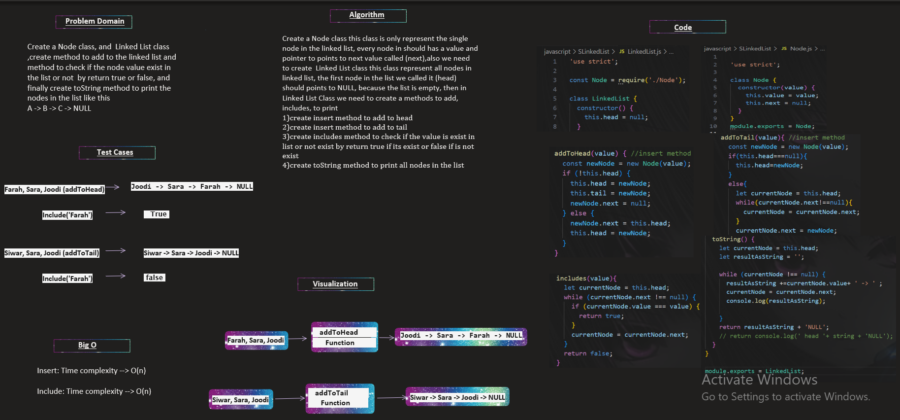

## Whiteboard Process:

**Singly Linked List**

____________________

## The Approach & Efficiency and solution:

 Create a Node class this class is only represent the single node in the linked list, every node in should has a value and pointer to points to next value called (next),also we need to create  Linked List class this class represent all nodes in linked list, the first node in the list we called it (head) should points to NULL, because the list is empty, then in Linked List Class we need to create a methods to add, includes, to print

1. create insert method to add to head
2. create insert method to add to tail
3. create includes method to check if the value is exist in list or not exist by return true if its exist or false if is not exist
4. create toString method to print all nodes in the list

by creating linked list in this way we will can insert node at the head with O(1) time complexity
, also we can add node to tail with O(n) time complexity, also we can check if the value is exist in the list or not, and we can convert the linked list into a string shape

**the code:**
the code inside LinkedList.js,and Node.js files

**Testing**
we have a lot of test cases to test the code:

1. Can successfully instantiate an empty linked list
2. Can properly insert into the linked list
3. The head property will properly point to the first node in the linked list
4. Can properly insert multiple nodes into the linked list
5. Will return true when finding a value within the linked list that exists
6. Will return false when searching for a value in the linked list that does not exist
7. Can properly return a collection of all the values that exist in the linked list

all these test cases passed successfully without failed ✔
(you can see how I did the testing for my code inside LinkedList.test.js)