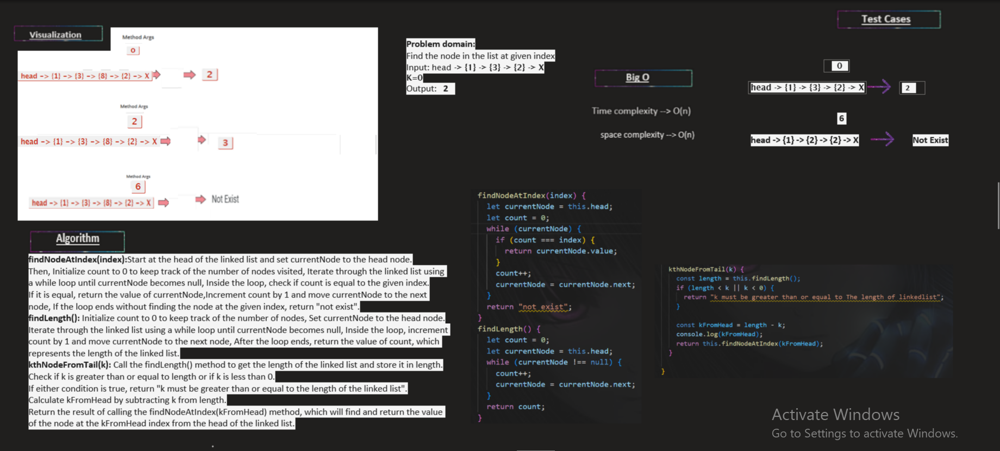

# Challenge Title
linked-list-kth.
Description,
Write the following method for the Linked List class:
kth from end
argument: a number, k, as a parameter.
Return the node’s value that is k places from the tail of the linked list.
You have access to the Node class and all the properties on the Linked List class as well as the methods created in previous challenges.
## Whiteboard Process:

new Addition for whiteboard:**findNodeAtIndex method**

## The Approach & Efficiency and solution:
findLength():
Approach: This method iterates through the linked list, starting from the head and traversing each node until the end of the list (null). It counts the number of nodes encountered during traversal and returns the count.
Efficiency: The time complexity of this method is O(n), where n is the length of the linked list, as it needs to traverse each node to count the length.
Solution: The provided code correctly implements the findLength() method.

findNodeAtIndex(index):
Approach: This method takes an index as an argument and iterates through the linked list, starting from the head. It increments a counter (count) with each node visit and checks if the current count matches the given index. If the index is found, it returns the value of the current node. If the end of the list is reached before finding the index, it returns the string "not exist."
Efficiency: The time complexity of this method is O(n), where n is the length of the linked list, as it needs to traverse the list to find the node at the given index.
Solution: The provided code correctly implements the findNodeAtIndex(index) method.
kthNodeFromTail(k):

Approach: This method first calculates the length of the linked list by invoking the findLength() method. It then checks if the given index k is within the valid range (greater than or equal to zero and less than the length of the list). If k is outside this range, it returns an error message. Otherwise, it calculates the index of the desired node from the head of the list (kFromHead) by subtracting k from the length of the list. Finally, it invokes the findNodeAtIndex(kFromHead) method to retrieve the value of the node at kFromHead.
Efficiency: The time complexity of this method is O(n), where n is the length of the linked list, as it relies on the findLength() and findNodeAtIndex() methods.
Solution: The provided code correctly implements the kthNodeFromTail(k) method.

**the code:**
the code inside LinkedList.js,and Node.js files

**Testing**
**Testing for finde node at given index**
1. when k is greater than the length of the linked list: return an error
2. when k is not a positive integer:throws an error
3. returns the value of the only node when the list size is 1
4. when k is in the middle of the list:return the correct value

all these test cases passed successfully without failed ✔
(you can see how I did the testing for my code inside LinkedList.test.js)
