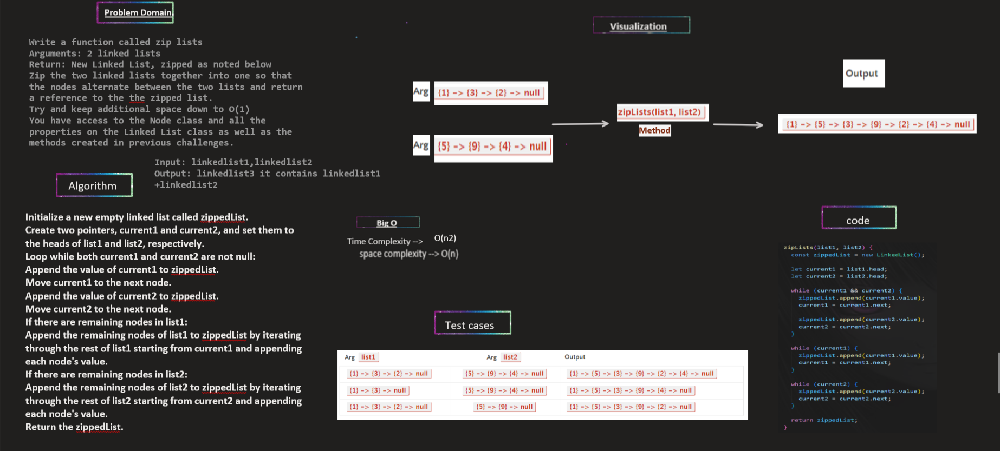

# Challenge Title

**linked-list-zip**
**Description:**
Write a function called zip lists
Arguments: 2 linked lists
Return: New Linked List, zipped as noted below
Zip the two linked lists together into one so that the nodes alternate between the two lists and return a reference to the the zipped list.
Try and keep additional space down to O(1)
You have access to the Node class and all the properties on the Linked List class as well as the methods created in previous challenges.

## Whiteboard Process:

new Addition for whiteboard:**linked-list-zip**

## The Approach & Efficiency and solution:
Approach:

Create an empty linked list called zippedList to store the merged result.
Initialize two pointers, current1 and current2, to the heads of list1 and list2 respectively.
Iterate over both lists simultaneously until either list1 or list2 reaches the end.
Append the value of current1 to zippedList and move current1 to the next node (if it exists).
Append the value of current2 to zippedList and move current2 to the next node (if it exists).
If there are remaining nodes in list1, append them to zippedList.
If there are remaining nodes in list2, append them to zippedList.
Return zippedList.
Efficiency:

Time complexity: The function iterates over the nodes of both list1 and list2 once, resulting in a linear time complexity of O(n), where n is the total number of nodes in both lists.
Space complexity: The function creates a new linked list, zippedList, to store the merged result. The space complexity is also O(n), where n is the total number of nodes in both lists since the size of the merged list can be at most n.

**the code:**
the code inside LinkedList.js,and Node.js files

**Testing**
**Testing for finde node at given index**

all these test cases passed successfully without failed ✔
(you can see how I did the testing for my code inside LinkedList.test.js)
//example: output on compiler about testing cases 
// Test case1: If list 1 taller than list 2 :
// list1: 55 -> 44 -> 33 -> 22 -> 11 -> NULL
// list2: 40 -> 50 -> 69 -> 89 -> NULL
// result:55 -> 40 -> 44 -> 50 -> 33 -> 69 -> 22 -> 89 -> 11 -> NULL
// ------------ --------------  --------------
// Test case2: If list 1 smaller than list 2 :
// list1: 33 -> 22 -> 11 -> NULL
// list2: 40 -> 50 -> 69 -> 89 -> NULL
// result:33 -> 40 -> 22 -> 50 -> 11 -> 69 -> 89 -> NULL
// ------------ --------------  --------------
// Test case3: If list 2 and list1 have the same size :
// list1: 22 -> 11 -> NULL
// list2: 40 -> 50 -> NULL
// result:22 -> 40 -> 11 -> 50 -> NULL
// ------------ --------------  --------------
// Test case4: If list 1 was empty and list 2 is not empty:
// list1: NULL
// list2: 40 -> 50 -> 69 -> 89 -> NULL
// result:40 -> 50 -> 69 -> 89 -> NULL
// ------------ --------------  --------------
