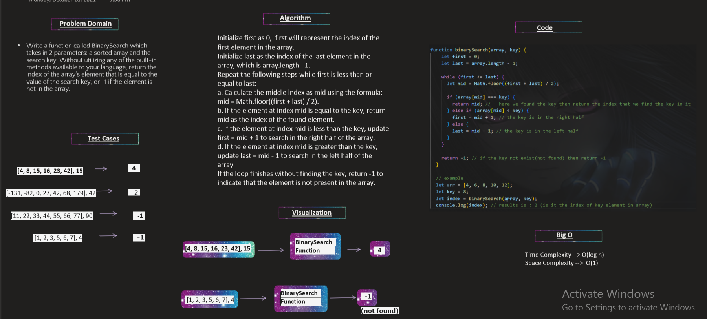

## Whiteboard Process:


____________________

## summary:

**Binary search** is an efficient search algorithm that operates on a sorted array. It works by repeatedly dividing the search space in half until the target element is found in the array or it return that the element is not exist in the array.

## The Approach & Efficiency:

to use Binary Search algorithm we can follow these 3 steps:

1. divide
2. compare
3. go left or go right
 by determine the search range with pointers -> first and last.
then calculate the mid index as the average of the first and left pointers.
Compare the target element with the element at the mid index:
If they are equal, the target is found.
If the key is less than the mid element, update the right(last) pointer to mid - 1.
If the key is greater than the mid element, update the left(first) pointer to mid + 1.
re do these steps until the key is found or the (first > last).

for the efficiency, Binary Search algorithm runs in O(1)space and O(log n) time, it usefull to efficient searching even in huge arrays.
also for the space complexity of binary search algorithm is O(1) as it does not  need extra space that scales with the input size.

**the code:**

```
function binarySearch(array, key) {
  let first = 0;
  let last = array.length - 1;

  while (first <= last) {
    let mid = Math.floor((first + last) / 2);

    if (array[mid] === key) {
      return mid; //   here we found the key then return the index that we find the key in it
    } else if (array[mid] < key) {
      first = mid + 1; // the key is in the right half
    } else {
      last = mid - 1; // the key is in the left half
    }
  }

  return -1; // if the key not exist(not found) then return -1
}

// example 
let arr = [4, 6, 8, 10, 12];
let key = 10;
let index = binarySearch(array, key);
console.log(index); // results is : 3 (is it the index of key element in array)
```

   
   
