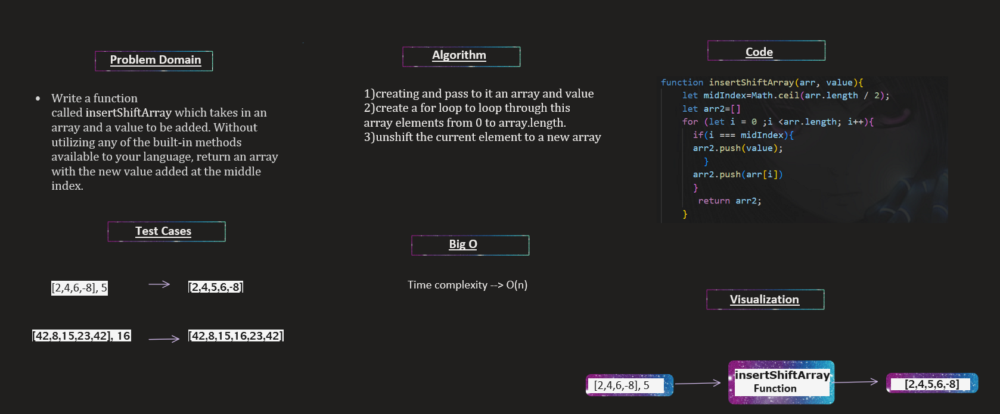

## Whiteboard Process:

____________________

## The Approach & Efficiency:
 to calculate the mid index of the array using the formula Math.ceil(arr.length / 2).
 Create a new array to store in it the modified array.
 using a for loop,loop through the array.
then checks if the current (index) is the mid index. If it the mid index then, adds the value at the mid index to the arr2(new array).
Adds the current element from array to the arr2(new array).
Returns (arr2) the modified array with the new value inserted at the mid index.

**the code:**

`function insertShiftArray(arr, value){
    let midIndex=Math.ceil(arr.length / 2);
    let arr2=[]
    for (let i = 0 ;i <arr.length; i++){
      if(i === midIndex){
      arr2.push(value);
        }
      arr2.push(arr[i])
      }
       return arr2;
    }`

   
   
