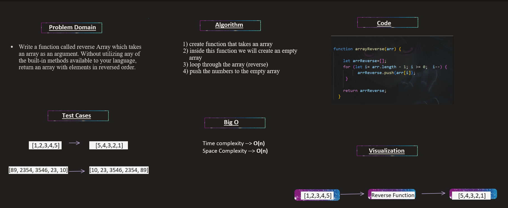

## Whiteboard Process:

____________________

## The Approach & Efficiency:
  1. create function that takes an array.
  2. inside this function we will create an empty array.
  3. loop through the array (reverse).
  4. push the numbers to the empty array.

**the code:**

`
 function arrayReverse(arr){
    let arrReverse=[];
    for (let i = arr.length-1 ;i >= 0; i--){
      arrReverse.push(arr[i]);
    }
    return arrReverse;
  }
   `