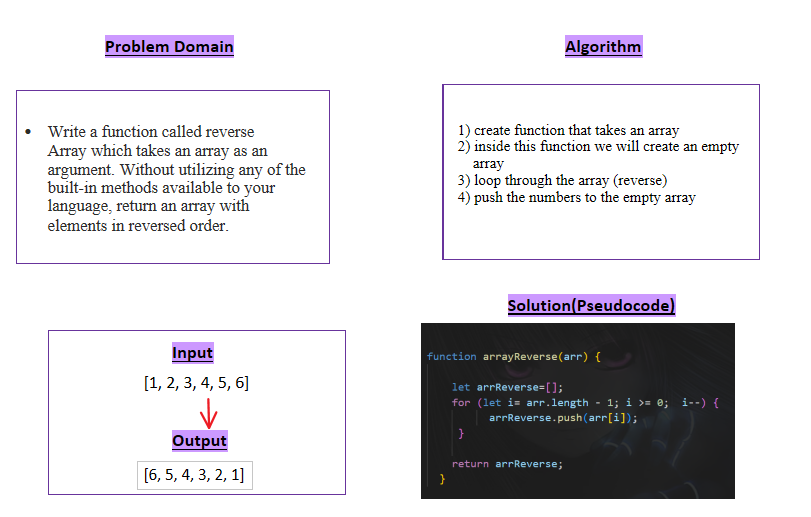

## Whiteboard Process:

____________________
The Approach:
  1. create function that takes an array.
  2. inside this function we will create an empty array.
  3. loop through the array (reverse).
  4. push the numbers to the empty array.