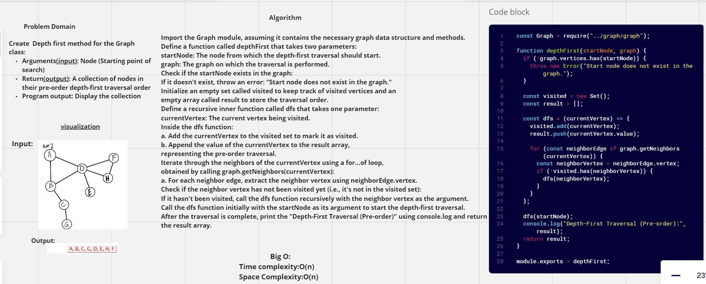
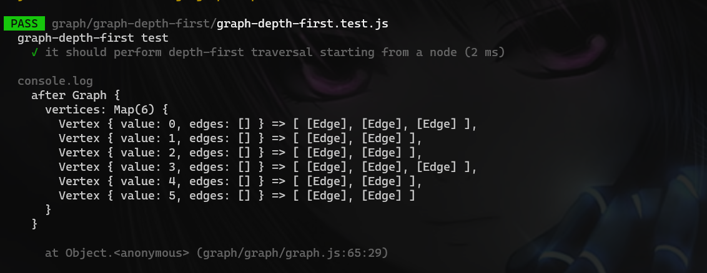

# whiteboard
>


**Code:**
```javascript
const Graph = require("../graph/graph");

function depthFirst(startNode, graph) {
  if (!graph.vertices.has(startNode)) {
    throw new Error("Start node does not exist in the graph.");
  }

  const visited = new Set();
  const result = [];

  const dfs = (currentVertex) => {
    visited.add(currentVertex);
    result.push(currentVertex.value);

    for (const neighborEdge of graph.getNeighbors(currentVertex)) {
      const neighborVertex = neighborEdge.vertex;
      if (!visited.has(neighborVertex)) {
        dfs(neighborVertex);
      }
    }
  };

  dfs(startNode);
  console.log("Depth-First Traversal (Pre-order):", result);
  return result;
}

module.exports = depthFirst;

let myGraph = new Graph();
const vertexA = myGraph.addVertex("A");
const vertexB = myGraph.addVertex("B");
const vertexC = myGraph.addVertex("C");
const vertexD = myGraph.addVertex("D");
const vertexE = myGraph.addVertex("E");
const vertexF = myGraph.addVertex("F");
const vertexG = myGraph.addVertex("G");
const vertexH = myGraph.addVertex("H");

// Add edges in the correct order
myGraph.addEdge(vertexA, vertexB);
myGraph.addEdge(vertexB, vertexC);
myGraph.addEdge(vertexC, vertexG);
myGraph.addEdge(vertexB, vertexD);
myGraph.addEdge(vertexA, vertexD);
myGraph.addEdge(vertexD, vertexE);
myGraph.addEdge(vertexD, vertexH);
myGraph.addEdge(vertexD, vertexF);
myGraph.addEdge(vertexF, vertexH);

const result = depthFirst(vertexA, myGraph);

console.log("Output:", result.join(", "));

```

**Test**
>