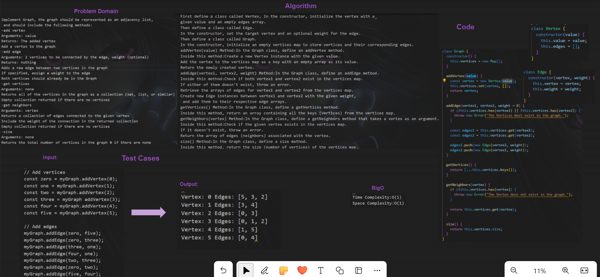

>## Graph:
>**Graphs** are essentially a combination of nodes (also called vertices) and edges, which serve to establish connections between pairs of nodes. Each edge signifies a specific relationship between two nodes.

>**Whiteboard & Code & Test**
>


>**code:**
```javascript

class Vertex {
  constructor(value) {
    this.value = value;
    this.edges = [];
  }
}

module.exports = Vertex;


class Edge {
  constructor(vertex, weight) {
    this.vertex = vertex;
    this.weight = weight;
  }
}
module.exports=Edge;


const Edge = require("./Edges");
const Vertex = require("./Vertex");


class Graph {
  constructor() {
    this.vertices = new Map();
  }

  addVertex(value) {
    const vertex = new Vertex(value);
    this.vertices.set(vertex, []);
    return vertex;
  }

  addEdge(vertex1, vertex2, weight = 0) {
    if (!this.vertices.has(vertex1) || !this.vertices.has(vertex2)) {
      throw new Error("The Vertices must exist in the graph.");
    }

    const edges1 = this.vertices.get(vertex1);
    const edges2 = this.vertices.get(vertex2);

    edges1.push(new Edge(vertex2, weight));
    edges2.push(new Edge(vertex1, weight));
  }

  getVertices() {
    return [...this.vertices.keys()];
  }

  getNeighbors(vertex) {
    if (!this.vertices.has(vertex)) {
      throw new Error("The Vertex does not exist in the graph.");
    }

    return this.vertices.get(vertex);
  }

  size() {
    return this.vertices.size;
  }
}
module.exports = Graph;


const myGraph = new Graph();

const zero = myGraph.addVertex(0);
const one = myGraph.addVertex(1);
const two = myGraph.addVertex(2);
const three = myGraph.addVertex(3);
const four = myGraph.addVertex(4);
const five = myGraph.addVertex(5);

myGraph.addEdge(zero, five);
myGraph.addEdge(zero, three);
myGraph.addEdge(three, one);
myGraph.addEdge(four, one);
myGraph.addEdge(two, three);
myGraph.addEdge(zero, two);
myGraph.addEdge(five, four);

console.log("after", myGraph);

for (const [vertex, edges] of myGraph.vertices.entries()) {
  console.log(
    "Vertex:",
    vertex.value,
    "Edges:",
    edges.map((edge) => edge.vertex.value)
  );
}


```


>**Test:** ✔
>[ Test File here](graph.test.js)
>
>
>


