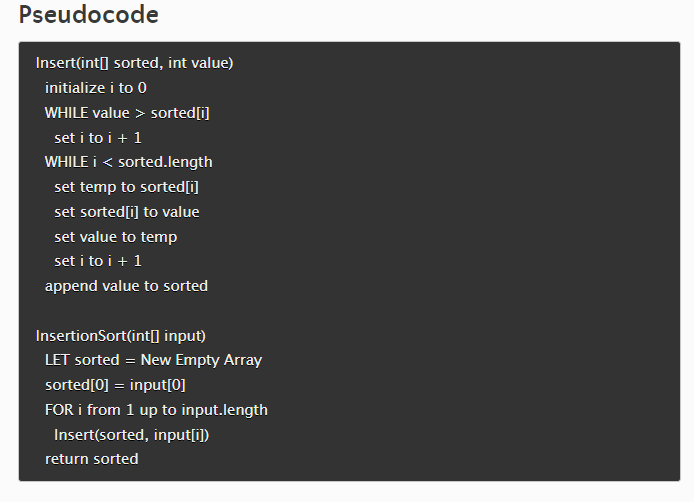

### insertion-sort:

>**Insertion sort** is a relatively simple sorting algorithm. It works by iterating through an array or list of items, comparing each item with the previous ones, and swapping them until the whole array is sorted.
Start with the first item and consider it as sorted.
Then move to the second and compare it to the first and swap them if the second is smaller than the first.
Then move to the third item and compare it to the second. If the third item is smaller than the second, a swap occurs. Now the second (previously third) item is compared to the first, and swapped if smaller.
Then move to the next item, compare with previous and swap - repeat until each item is sorted.

---
#### code:

```
function insertionSort(arr) {
  let sorted = [];
  sorted[0] = arr[0];

  for (let i = 1; i < arr.length; i++) {
    insert(sorted, arr[i]);
  }
  return sorted;
}

function insert(sorted, value) {
  let i = 0;

  while (value > sorted[i]) {
    i++;
  }

  while (i < sorted.length) {
    let temp = sorted[i];
    sorted[i] = value;
    value = temp;
    i++;
  }
  sorted.push(value);
}
```

---

#### Tracing:


---

#### Sample Array: [8,4,23,42,16,15]


#### Steps:

>**step 1:**
```
            // sorted, value           
function insert([8], 4) {
  let i = 0;

                ❔
        //  4   >      8       ---> ❌ false (go to next while loop)
  while (value > sorted[i]) {
    i++;
  }

                      ❔
//iteration:(1)    0  <    1          ---> true ✔
                      ❔
//iteration:(2)    1  <    1           ---> false ❌  (break)

            while (i < sorted.length) {

           let temp = sorted[i]; //temp = 8
           sorted[i] = value; // sorted=[4]
           value = temp;      // value = 8
           i++;    //  i = 1 , go to the next iteration
  }
  sorted.push(value); //[4,8]
}

                          //arr
function insertionSort([8,4,23,42,16,15]) {
  let sorted = [];
  sorted[0] = arr[8];

  for (let i = 1; i < arr.length; i++) { // i =1

//     sorted, arr[i]
    insert( [8], 4);

  }
  return sorted;
}
```

---

>**step 2:**
```
            // sorted, value           
function insert([4,8], 23) {
  let i = 0;

                      ❔
//iteration:(1)   23   >     4       ---> ✔ true

                      ❔
//iteration:(2)   23   >     8       ---> ✔ true

                      ❔
//iteration:(3)   23   >    undefined    ---> ❌false --break

          while (value > sorted[i]) {
                i++;
             }


                      ❔
//iteration:(1)    2  <    2         ---> ❌false --break
                     
            while (i < sorted.length) {

           let temp = sorted[i]; 
           sorted[i] = value;
           value = temp;   
           i++;   
  }
  sorted.push(value); //[4,8,23]
}

                          //arr
function insertionSort([8,4,23,42,16,15]) {
  let sorted = [];
  sorted[0] = arr[8];

  for (let i = 1; i < arr.length; i++) { // i = 2

//     sorted, arr[i]
    insert( [4,8], 23);   // arr[2] = 23

  }
  return sorted;
}
```


---


>**step 3:**
```
            // sorted, value           
function insert([4,8,23], 42) {
  let i = 0;

                      ❔
//iteration:(1)   42   >     4       ---> ✔ true

                      ❔
//iteration:(2)   42   >     8       ---> ✔ true

                      ❔
//iteration:(3)   42   >     23       ---> ✔ true

                      ❔
//iteration:(4)   42   >    undefined    ---> ❌false --break

          while (value > sorted[i]) {
                i++; // i = 1, go to the loop again // i = 2,  go to the loop again // i = 3
             }


                      ❔
//iteration:(1)    3  <    3        ---> ❌false --break
                     
            while (i < sorted.length) {

           let temp = sorted[i]; 
           sorted[i] = value;
           value = temp;   
           i++;   
  }
  sorted.push(value); //[4,8,23,42]
}

                          //arr
function insertionSort([8,4,23,42,16,15]) {
  let sorted = [];
  sorted[0] = arr[8];

  for (let i = 1; i < arr.length; i++) { // i = 3

//     sorted, arr[i]
    insert( [4,8,23],42);   // arr[3] = 42

  }
  return sorted;
}
```


---

>**step 4:**
```
            // sorted, value           
function insert([4,8,23,42],16) {
  let i = 0;

                      ❔
//iteration:(1)   16   >     4       ---> ✔ true

                      ❔
//iteration:(2)   16   >     8       ---> ✔ true

                      ❔
//iteration:(3)   16   >     23       ---> ❌false --break


          while (value > sorted[i]) {
                i++; // i = 1, go to the loop again // i = 2,  go to the loop again 
             }


                      ❔
//iteration:(1)    2  <    4        ---> ✔ true
                     

                      ❔
//iteration:(2)    3  <    4        ---> ✔ true
                            

                      ❔
//iteration:(3)    4  <    4        ---> ❌false --break


            while (i < sorted.length) {

           let temp = sorted[i]; //iteration(1) temp = 23 , //iteration(2) temp = 42
           sorted[i] = value;    //iteration(1) sorted = [4,8,16,42], //iteration(2) temp = [4,8,16,23]
           value = temp;   //iteration(1) value = 23 , //iteration(2) temp = 42
           i++;    //i =3, go to the loop again // i = 4, go to the loop again also
  }
  sorted.push(value); // current sorted =[4,8,16,23] , now push the last value (42 )  -> then the final sorted is = [4,8,16,23,42]
}

                          //arr
function insertionSort([8,4,23,42,16,15]) {
  let sorted = [];
  sorted[0] = arr[8];

  for (let i = 1; i < arr.length; i++) { // i = 4

//     sorted, arr[i]
    insert( [4,8,23,42],16);   // arr[4] = 16

  }
  return sorted;
}
```


---

>**step 5:**
```
            // sorted, value           
function insert([4,8,16,23,42],15) {
  let i = 0;

                      ❔
//iteration:(1)   15   >     4       ---> ✔ true

                      ❔
//iteration:(2)   15   >     8       ---> ✔ true

                      ❔
//iteration:(3)   15   >     16       ---> ❌false --break


          while (value > sorted[i]) {
                i++; // i = 1, go to the loop again // i = 2,  go to the loop again
             }


                      ❔
//iteration:(1)    2  <    5        ---> ✔ true
                     

                      ❔
//iteration:(2)    3  <    5        ---> ✔ true
                            

                      ❔
//iteration:(3)    4  <    5        ---> ✔ true
                            

                      ❔
//iteration:(4)    5  <    5        ---> ❌false --break


            while (i < sorted.length) {

           let temp = sorted[i]; //iteration(1) temp = 16 , //iteration(2) temp = 23 // iteration(3) temp = 42

           sorted[i] = value;    //iteration(1) sorted = [4,8,15,42], //iteration(2) sorted = [4,8,15,16] // iteration(3) sorted = [4,8,15,16,23]

           value = temp;   //iteration(1) value = 16 , //iteration(2) temp = 23   // iteration(3) value = 42

           i++;    //i =3, go to the loop again // i = 4, go to the loop again also // i=5, go to the loop again
  }
  sorted.push(value); // current sorted =[4,8,16,23] , now push the last value (42 )  -> then the final sorted is = [4,8,16,23,42]
}

                          //arr
function insertionSort([8,4,23,42,16,15]) {
  let sorted = [];
  sorted[0] = arr[8];

  for (let i = 1; i < arr.length; i++) { // i = 5

//     sorted, arr[i]
    insert( [4,8,16,23,42],15);   // arr[5] = 15

  }
  return sorted;
}
```

---


>**last step:**
```
            // sorted, value           
function insert([4,8,16,23,42],15) {
  let i = 0;

                      ❔
//iteration:(1)   15   >     4       ---> ✔ true

                      ❔
//iteration:(2)   15   >     8       ---> ✔ true

                      ❔
//iteration:(3)   15   >     16       ---> ❌false --break


          while (value > sorted[i]) {
                i++; // i = 1, go to the loop again // i = 2,  go to the loop again
             }


                      ❔
//iteration:(1)    2  <    5        ---> ✔ true
                     

                      ❔
//iteration:(2)    3  <    5        ---> ✔ true
                            

                      ❔
//iteration:(3)    4  <    5        ---> ✔ true
                            

                      ❔
//iteration:(4)    5  <    5        ---> ❌false --break


            while (i < sorted.length) {

           let temp = sorted[i]; //iteration(1) temp = 16 , //iteration(2) temp = 23 // iteration(3) temp = 42

           sorted[i] = value;    //iteration(1) sorted = [4,8,15,42], //iteration(2) sorted = [4,8,15,16] // iteration(3) sorted = [4,8,15,16,23]

           value = temp;   //iteration(1) value = 16 , //iteration(2) temp = 23   // iteration(3) value = 42

           i++;    //i =3, go to the loop again // i = 4, go to the loop again also // i=5, go to the loop again
  }
  sorted.push(value); // current sorted =[4,8,15,16,23] , now push the last value (42 )  -> then the final sorted is = [4,8,15,16,23,42]
}

                          //arr
function insertionSort([8,4,23,42,16,15]) {
  let sorted = [];
  sorted[0] = arr[8];

  for (let i = 1; i < arr.length; i++) { //   i = 6
                                        //   i < arr.length
                                        //     ❔
                                        //    6 < 6   ----> ❌false ,  -- so break

//     sorted, arr[i]
    insert( [4,8,16,23,42], 15);   // arr[5] = 15

  }
  return sorted;// here to return the last sorted Array which is [4,8,15,16,23,42]
}
```


>**Testing**:  -- DONE -- ✔
```describe('Insertion Sort', () => {

  it('Returns a sorted array from the input array', () => {

    expect(insertionSort([8,4,23,42,16,15])).toEqual([ 4, 8, 15, 16, 23, 42 ]);
  });
});
```
---

>**Big o**:
**Time complexity:** O(n^2)
**Space Complexity:** O(n)