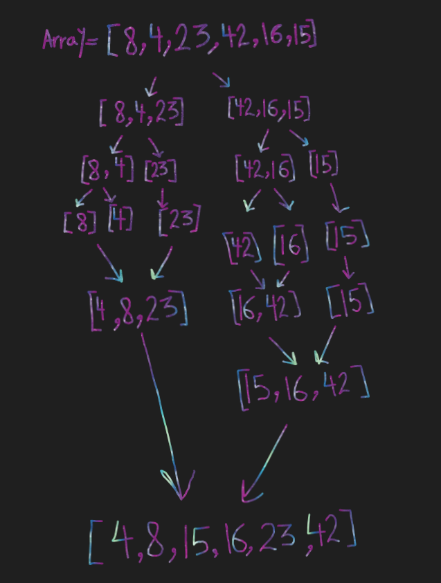

### merge-sort:
 Merge sort algorithm takes an unsorted array, recursively divides it into smaller halves, sorts each half, and then merges these sorted halves back together to produce a fully sorted array. This process repeats until the entire array is sorted.


Pseudo Code
```
ALGORITHM Mergesort(arr)
    DECLARE n <-- arr.length 

    if n > 1
      DECLARE mid <-- n/2
      DECLARE left <-- arr[0...mid]
      DECLARE right <-- arr[mid...n]
      // sort the left side
      Mergesort(left)
      // sort the right side
      Mergesort(right)
      // merge the sorted left and right sides together
      Merge(left, right, arr)

ALGORITHM Merge(left, right, arr)
    DECLARE i <-- 0
    DECLARE j <-- 0
    DECLARE k <-- 0

    while i < left.length && j < right.length
        if left[i] <= right[j]
            arr[k] <-- left[i]
            i <-- i + 1
        else
            arr[k] <-- right[j]
            j <-- j + 1

        k <-- k + 1

    if i = left.length
       set remaining entries in arr to remaining values in right
    else
       set remaining entries in arr to remaining values in left
```

#### Sample Arrays:
[8,4,23,42,16,15]
#### summary of all steps:

Sample Array: [8,4,23,42,16,15]
**step1:** split into [8, 4, 23] & [42, 16, 15]
**step2:** split into [8], [4], [23], [42], [16], [15]
**step3:** sort each subarrays: [4, 8, 23], [15, 16, 42]
**step4:** merge [4, 8, 23] & [15, 16, 42] to get [4, 8, 15, 16, 23, 42]
**sorted Array:** [4,8,15,16,23,42]


**Tracing in details:**
lets say the mergeSort function is called with the initial array array 
array = [8, 4, 23, 42, 16, 15];

#### Step1:

          
```function mergeSort(arr) {//[8, 4, 23, 42, 16, 15]
  let n = arr.length; // the length of the array = 6

        ❔
     6  > 1   --> true  ✔
  if (n > 1) {
                     // (6 / 2) = 3
    let mid = Math.floor(n / 2);
   // The array is split into two halves: left and right

    let left = arr.slice(0, mid); // left = [8, 4, 23] 

    let right = arr.slice(mid, n); //right = [42, 16, 15].

    mergeSort(left);// mergeSort(left) is called, initiating the sorting process for ---> left half. // **go to step2**

    mergeSort(right);
    merge(left, right, arr);
  }
  return arr;
}
```

#### Step2:
                   //[8, 4, 23]
```function mergeSort(arr) {
  let n = arr.length; // the length of the array = 3

        ❔
     3  > 1   --> true  ✔
  if (n > 1) {
                     // (3 / 2) = 1.5
    let mid = Math.floor(n / 2);
   // The array is split into two halves: left and right

    let left = arr.slice(0, mid); // left = [8]

    let right = arr.slice(mid, n); //right = [4, 23].

    mergeSort(left);// is called, which means we are applying the mergeSort algorithm recursively to the left half of the array [8, 4, 23]. //**go to step3**

    mergeSort(right);
    merge(left, right, arr);
  }
  return arr;
}
```

#### Step3:

                   //[8]
```function mergeSort(arr) {
  let n = arr.length; // the length of the array = 1

        ❔
     1  > 1   --> false  ❌
  if (n > 1) {
                     // (3 / 2) = 1.5
    let mid = Math.floor(n / 2);

    let left = arr.slice(0, mid);

    let right = arr.slice(mid, n);

    mergeSort(left);
    mergeSort(right);
    merge(left, right, arr);
  }
  return arr;

 // we check if it needs further sorting. Since [8] only contains one element, it doesn't need to be sorted, so it's returned as is. This is the base case for the left half.
The base case for a merge sort is when the array to be sorted contains one element or is empty because a single element or an empty array is inherently sorted.
In this case, the function immediately returns -->  [8].
}
// We haven't done anything to the right half [4, 23] yet so lets go
```

#### Step4:
                   //[4, 23]
```function mergeSort(arr) {
  let n = arr.length; // the length of the array = 2

        ❔
     2  > 1   --> true  ✔
  if (n > 1) {
                     // (2 / 2) = 1
    let mid = Math.floor(n / 2);
   // The array is split into two halves: left and right

    let left = arr.slice(0, mid); // left = [4]

    let right = arr.slice(mid, n); //right = [23].

    mergeSort(left);//For the left half [4], we reach the base case again because it has only one element. It's returned immediately as [4].

    mergeSort(right); //After the left half [4] is sorted, we continue in the mergeSort function for the right half [23].

    //here we reached a point where both left and right halves of [4, 23] are sorted.
We call the merge function to merge these sorted halves back together into the original arr.

        //[4]  //[23]
    merge(left, right, arr);
  }
  return arr;
}```

```function merge(left, right, arr) {
  let i = 0;
  let j = 0;
  let k = 0;

  while (i < left.length && j < right.length) {

        //    4 <= 23
    if (left[i] <= right[j]) {

        4
      arr[k] = left[i];
      i++; //do ➡ i++
    } else {
      arr[k] = right[j];
      j++;
    }
    k++;  //do ➡ k++
  }
// The second iteration compares left[1] -->(which doesn't exist because left is exhausted) with right[j] (which is 23), so 23 is placed in the arr[k] position and j and k are incremented.
The result is that arr now contains [4, 23], which is sorted.

  if (i === left.length) {
    let rightRest = right.slice(j);
    arr = arr.splice(k, arr.length - k, ...rightRest);
  } else {
    let leftRest = left.slice(i);
    arr = arr.splice(k, arr.length - k, ...leftRest);
  }
}

now after merge [4, 23] which is the right half, now the right half have been sorted
```now inside the mergeSort()//now that both the left and right halves are sorted, we call the merge function again, this time to merge [8] ➡(left) and [4, 23] ➡ (right) back into the original arr, the merge function will iterate through the two halves and combine them into a sorted order in arr,
After merging left and right half, the function will returns the merged and sorted array, which is ➡ [4, 8, 23].
This completes the sorting process for the left half [8, 4, 23].
now the right half is [42, 16, 15], so we need to sort and merge the right half.
The same recursive process is applied to the right half [42, 16, 15].
so the mergeSort function is called again on the right array.
The right half is divided further ➡: [42] & [16, 15].
the left halfhase only one element so its immediately returned as sorted.
After the left half of the right array [16, 15] has been sorted, we will continue in the mergeSort function for the right half.
now this is the right half ➡ [16,15]  is now sorted and needs to be merged.
The merge function is called to merge [16] (left) and [15] (right) into the original arr.
Since the two arrays contain only one element each, they are directly merged into the arr.
Inside mergeSort(Returning Merged & Sorted Array for Right Half)
The merged and sorted right half [15, 16] is returned.
After the (right half) ➡ [42, 16, 15] has been sorted and merged,so lets go to merge all the array.
The sorted left half ➡ [4, 8, 23] and the sorted right half ➡ [15, 16, 42].
 Inside mergeSort(Merging all the Array)
The merge function is called again to merge the two sorted halves:  (left) ➡ [4, 8, 23] & (right) ➡ [15, 16, 42]  into the original arr.
The merge process ensures that the merged array remains sorted.
now after the last merging, the function returns the final sorted array ➡ [4, 8, 15, 16, 23, 42].
```

>**code**
```function mergeSort(arr) {
  let n = arr.length;

  if (n > 1){
    let mid = n / 2;
    let left = arr.slice(0, mid);
    let right = arr.slice(mid, n);

    mergeSort(left);
    mergeSort(right);
    merge(left, right, arr);
  }
  return arr;
}

function merge(left, right, arr) {
  let i = 0;
  let j = 0;
  let k = 0;

  while (i < left.length && j < right.length) {
    if (left[i] <= right[j]) {
      arr[k] = left[i];
      i++;
    } else {
      arr[k] = right[j];
      j++;
    }
    k++;
  }

  if (i === left.length) {
    let rightRest = right.slice(j);
    arr = arr.splice(k, arr.length - k, ...rightRest);
  } else {
    let leftRest = left.slice(i);
    arr = arr.splice(k, arr.length - k, ...leftRest);
  }
}

```

>**Testing**:  -- DONE -- ✔
```describe('Merge Sort', () => {
  it('Return sorted array from input array', () => {
    expect(mergeSort([8, 4, 23, 42, 16, 15])).toEqual([4, 8, 15, 16, 23, 42]);
  });
});
```
---

>**Big o**:
**Time complexity:**  O(n log n)
**Space Complexity:** O(n)