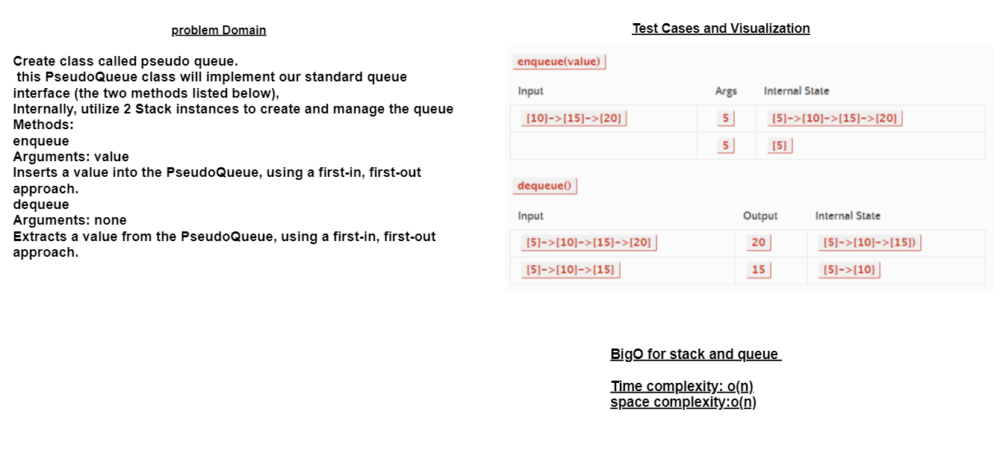
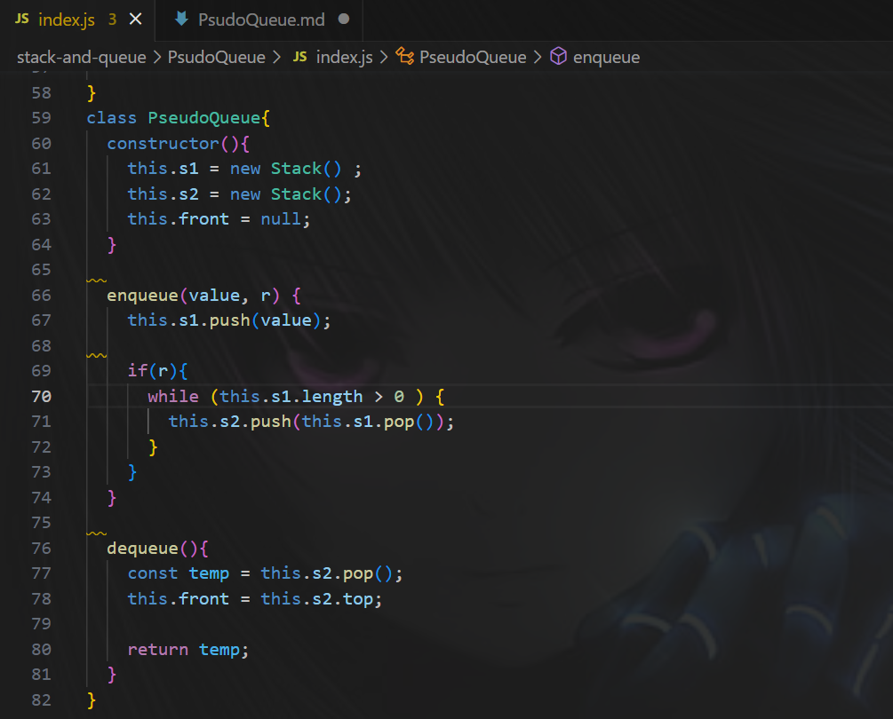

>## Code:
>
>problem domain:Implement a Queue using two Stacks.
>

>Approach:

The PseudoQueue class is initialized with two stacks: s1 and s2.
When enqueueing an element, it is pushed onto s1.
If the r flag is true, the elements in s1 are reversed by popping them from s1 and pushing them onto s2.
When dequeueing an element, it is popped from s2 and the front of the queue (front variable) is updated to the top of s2.
The dequeued element is returned.
Efficiency:
Let's analyze the efficiency of the code:

Enqueue Operation:

Time complexity: O(n)
In the worst case, if the r flag is true, reversing the elements in s1 requires popping all elements from s1 (O(n)) and pushing them onto s2 (O(n)), where n is the number of elements in s1.
Space complexity: O(1)
The space used is constant as it does not depend on the number of elements.
Dequeue Operation:

Time complexity: O(1)
Popping an element from s2 and updating the front of the queue (front variable) can be done in constant time.
Space complexity: O(1)
The space used is constant as it does not depend on the number of elements.
Solution:
The code provides a solution for implementing a pseudo queue using two stacks. It allows enqueueing and dequeueing elements efficiently. The enqueue operation pushes elements onto s1 and reverses the elements if needed. The dequeue operation pops an element from s2 and updates the front of the queue.