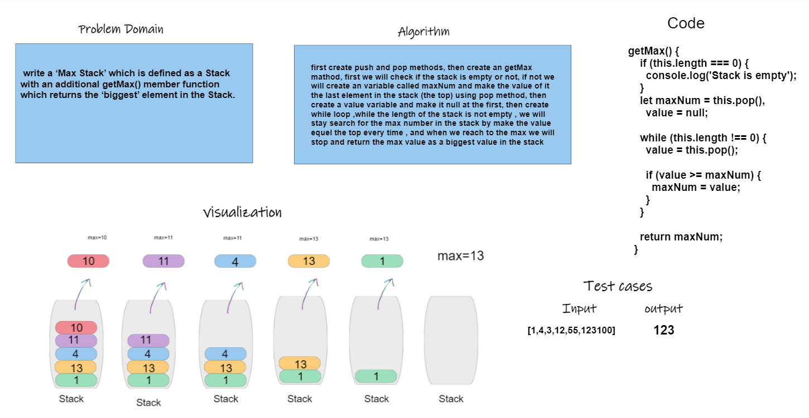

>>maxStack whiterboard
>>
>>### CODE:
```
  getMax() {
    if (this.length === 0) {
      console.log('Stack is empty');
    }
    let maxNum = this.pop(),
      value = null;

    while (this.length !== 0) {
      value = this.pop();

      if (value >= maxNum) {
        maxNum = value;
      }
    }

    return maxNum;
  }
```