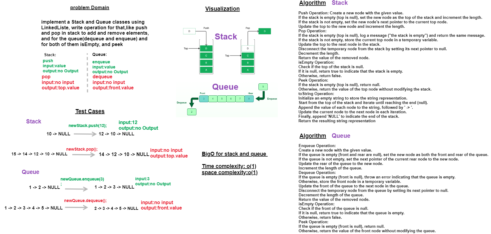

## Whiteboard Process:

**Stack & Queue**


addition for test cases:

**isEmpty:**
input:no input.    
output:true or false.

**peek:**
input:no input.    
output:
in queue(value of front),
in stack(top.value)

---

## The Approach & Efficiency and solution:

**Stack**
In the **push operation**, a new node is created with the given value and inserted at the top of the stack.
The time complexity of the push operation is O(1) since it doesn't depend on the size of the stack but only involves updating the top and length attributes.
Pop Operation:

The **pop operation** removes and returns the top element from the stack.
If the stack is empty, an error message is displayed, and 'the stack is empty' is returned.
Otherwise, the top node is stored in a temporary variable, and the top pointer is updated to the next node in the stack.
The time complexity of the pop operation is O(1) since it only involves updating the top and length attributes.
isEmpty Operation:

The **isEmpty operation** checks if the stack is empty by verifying if the top pointer is null.
The time complexity of the isEmpty operation is O(1) as it involves a simple null check.
Peek Operation:

The **peek operation** returns the value of the top element without modifying the stack.
If the stack is empty, null is returned; otherwise, the value of the top node is returned.
The time complexity of the peek operation is O(1) as it only requires accessing the value of the top node.
toString Operation:

The **toString operation** constructs a string representation of the stack by iterating through each node starting from the top.
It appends the value of each node followed by ' -> ' to the resulting string.
Finally, it appends 'NULL' to indicate the end of the stack.
The time complexity of the toString operation is O(n), where n is the number of nodes in the stack, as it requires iterating through all nodes.

**Solution:**

The code is a complete implementation of the stack data structure with the required operations: push, pop, isEmpty, peek, and toString. The Node class is also provided separately and used for creating the nodes in the stack. To use the stack, you can create a new instance of the Stack class and then perform operations such as pushing elements, popping elements, checking if the stack is empty, peeking at the top element, or getting a string representation of the stack.

---

 **Queue**

In the **enqueue operation**, a new node is created with the given value and added to the rear of the queue.
If the queue is empty, both the front and rear pointers are set to the new node.
Otherwise, the new node is linked to the current rear node, and the rear pointer is updated to the new node.
The time complexity of the enqueue operation is O(1) since it doesn't depend on the size of the queue but only involves updating the rear* and length attributes.
Dequeue Operation:

The **dequeue operation** removes and returns the front element from the queue.
If the queue is empty, an error message is thrown, indicating that the queue is empty.
Otherwise, the front node is stored in a temporary variable, the front pointer is updated to the next node in the queue, and the value of the temporary node is returned.
The time complexity of the dequeue operation is O(1) since it only involves updating the front and length attributes.
isEmpty Operation:

The **isEmpty operation** checks if the queue is empty by verifying if the front pointer is null.
The time complexity of the isEmpty operation is O(1) as it involves a simple null check.
Peek Operation:

The **peek operation** returns the value of the front element without modifying the queue.
If the queue is empty, null is returned; otherwise, the value of the front node is returned.
The time complexity of the peek operation is O(1) as it only requires accessing the value of the front node.
toString Operation:

The **toString operation** constructs a string representation of the queue by iterating through each node starting from the front.
It appends the value of each node followed by ' -> ' to the resulting string.
Finally, it appends 'NULL' to indicate the end of the queue.
The time complexity of the toString operation is O(n), where n is the number of nodes in the queue, as it requires iterating through all nodes.

**Solution:**

The code is a complete implementation of the queue data structure with the required operations: enqueue, dequeue, isEmpty, peek, and toString. The Node class is also provided separately and used for creating the nodes in the queue. To use the queue, you can create a new instance of the Queue class and then perform operations such as enqueueing elements, dequeuing elements, checking if the queue is empty, peeking at the front element, or getting a string representation of the queue.

---

**the code:**
**Stack**

```'use strict';

class Node {
  constructor(value){
    this.value=value;
    this.next=null;
  }
}

module.exports = Node;

'use strict';

const Node = require('../Node');

class Stack {
  constructor() {
    this.top = null;
    this.length = 0;
  }

  push(value){
    const newNode=new Node(value);

    if(this.isEmpty()){
      this.top=newNode;
      this.length++;
    }
    else{
      newNode.next=this.top;
      this.top=newNode;
      this.length++;
    }
  }
  pop(){
    if(this.isEmpty()){
      console.log('the stack is empty');
      return 'the stack is empty';
    }
    else{
      const temp=this.top;
      this.top=this.top.next;
      temp.next=null;
      this.length--;
      return temp.value;
    }
  }
  isEmpty(){
    return this.top === null;
  }
  peek(){
    if(this.isEmpty()) return null;
    return this.top.value;
  }
  toString() {
    let currentNode = this.top;
    let resultAsString = '';

    while (currentNode !== null) {
      resultAsString +=currentNode.value+ ' -> ' ;
      currentNode = currentNode.next;
      //   console.log(resultAsString);
    }
    return resultAsString + 'NULL';
    // return console.log(' head '+ string + 'NULL');
  }

}
```

---

**Queue**

```'use strict';

class Node {
  constructor(value){
    this.value=value;
    this.next=null;
  }
}

module.exports = Node;

'use strict';

const Node = require('../Node');
class Queue{
  constructor(){
    this.front=null;
    this.rear=null;
    this.length=0;
  }

  isEmpty() {
    return this.front === null;
  }

  toString() {
    let currentNode = this.front;
    let resultAsString = '';

    while (currentNode !== null) {
      resultAsString +=currentNode.value+ ' -> ' ;
      currentNode = currentNode.next;
      //   console.log(resultAsString);
    }
    return resultAsString + 'NULL';
    // return console.log(' head '+ string + 'NULL');
  }

  enqueue(value){
    const newNode = new Node(value);
    if(this.isEmpty()){
      this.front=newNode;
      this.rear=newNode;
    }
    else{
      this.rear.next=newNode;
      this.rear=newNode;
    }
    console.log(newNode);
    this.length++;
  }

  dequeue(){
    if(this.isEmpty()) {
      throw new Error('queue is empty!');
    }
    const temp= this.front;
    this.front=this.front.next;
    temp.next=null;
    this.length--;

    return temp.value;

  }

  peek(){
    if (this.isEmpty()) return null;
    return this.front.value;
  }
}
```


---

**Feature tasks for this challenge are completed**

**Stack**
These feature tasks together is complete implementation of a stack data structure using a linked list. The stack supports operations such as checking if it is empty, adding elements to the top, removing elements from the top, peeking at the top element, and obtaining a string representation of the stack.

**Queue**
These feature tasks together is complete implementation of a queue data structure using a linked list. The queue supports operations such as checking if it is empty, adding elements to the rear, removing elements from the front, peeking at the front element, and obtaining a string representation of the queue.


**Testing The Stack**

0. Can successfully push onto a stack
1. Can successfully push multiple values onto a stack
2. Can successfully pop off the stack
3. Can successfully empty a stack after multiple pops
4. Can successfully peek the next item on the stack
5. Can successfully instantiate an empty stack
6. Calling pop or peek on empty stack raises exception

all these test cases passed successfully without failed ✔

**Testing The Queue**

0. Can successfully create new instance from the Queue
1. Can successfully enqueue into a queue
2. Can successfully enqueue multiple values into a queue
3. Can successfully dequeue out of a queue the expected value
4. Can successfully peek into a queue, seeing the expected value
5. Can successfully empty a queue after multiple dequeues
6. Can successfully instantiate an empty queue
7. Calling dequeue or peek on empty queue raises exception

all these test cases passed successfully without failed ✔

---
