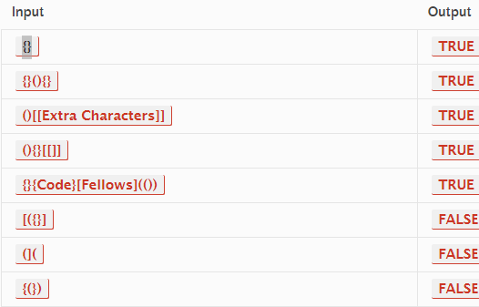

## stack-queue-brackets

>>## WhiteBoard

>>**Problem domain:**
>>create a function called validate brackets
Arguments: string
Return: boolean
representing whether or not the brackets in the string are balanced,
>>There are 3 types of brackets:
Round Brackets : ()
Square Brackets : []
Curly Brackets : {}

>>example input and outputs:**(TEST CASES)**

## Algorithm
>1. declare an empty stack (stack) and an object (brackets) that maps opening brackets to their corresponding closing brackets.
>2. Iterate over each character (char) in the input string (str) using a for loop.
>3. If char is an opening bracket ((, [, or {), push it onto the stack.
>4. If char is a closing bracket (), ], or }), do the following:
>5. Pop the last opening bracket (openBracket) from the stack.
>6. Check if the closing bracket for openBracket in the brackets object matches char. If they don't match, return false immediately, as the brackets are not balanced.
>7. After processing all characters in str, check if the stack is empty. If it is, return true, indicating that all opening brackets were properly closed with their corresponding closing brackets. Otherwise, return false.

>**step-by-step example** to illustrate the algorithm using the input string [{()}]:
Initialize the stack as an empty array: stack = [].
Iterate over each character in the input string:
Character { is an opening bracket, so push it onto the stack: stack = ['{'].
Character [ is also an opening bracket, so push it onto the stack: stack = ['{', '['].
Character ( is an opening bracket, so push it onto the stack: stack = ['{', '[', '('].
Character } is a closing bracket. Pop the last opening bracket (() from the stack and check if it matches the closing bracket. Since they don't match ('(' !== '}'), return false.
The algorithm ends here because the closing bracket did not match the last opening bracket. The function returns false.
The algorithm works similarly for other cases. If all opening brackets are matched properly with their corresponding closing brackets, the stack will be empty at the end, and the function will return true. Otherwise, it returns false, indicating unbalanced brackets.


## the code:
```'use strict';

function validateBrackets(str) {

  const stack = [];

  const brackets = {
    '(': ')',
    '[': ']',
    '{': '}'
  };

  for (let i = 0; i < str.length; i++) {
    const char = str[i];
    if (char === '(' || char === '[' || char === '{') {
      stack.push(char);
    }
    else if (char === ')' ||char === ']' || char === '}') {
      const openBracket = stack.pop();
      // brackets[stack.pop()]
      if (brackets[openBracket] !== char)
        return false;
    }
  }
  return stack.length === 0;
}```