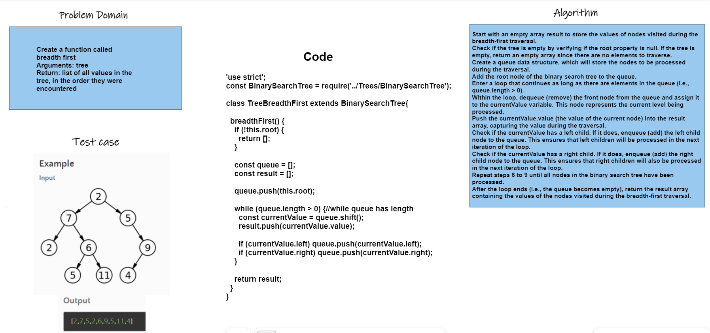

>## Tree Breadth First:
>
>### WhiteBoard
>
>
---
Code:
```'use strict';
const BinarySearchTree = require('../Trees/BinarySearchTree');

class TreeBreadthFirst extends BinarySearchTree{

  breadthFirst() {
    if (!this.root) {
      return [];
    }

    const queue = [];
    const result = [];

    queue.push(this.root);

    while (queue.length > 0) {//while queue has length
      const currentValue = queue.shift();
      result.push(currentValue.value);

      if (currentValue.left) queue.push(currentValue.left);
      if (currentValue.right) queue.push(currentValue.right);
    }

    return result;
  }
}
module.exports=TreeBreadthFirst;```

