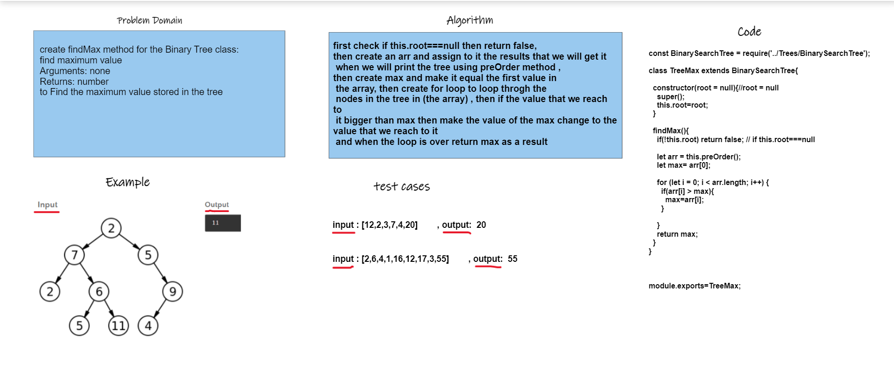

>#### get max in tree
>whiteboard
>
>
>
---
>**Code**
```'use strict';
const BinarySearchTree = require('../Trees/BinarySearchTree');

class TreeMax extends BinarySearchTree{

  constructor(root = null){//root = null
    super();
    this.root=root;
  }

  findMax(){
    if(!this.root) return false; // if this.root===null

    let arr = this.preOrder();
    let max= arr[0];

    for (let i = 0; i < arr.length; i++) {
      if(arr[i] > max){
        max=arr[i];
      }

    }
    return max;
  }
}


module.exports=TreeMax;
```