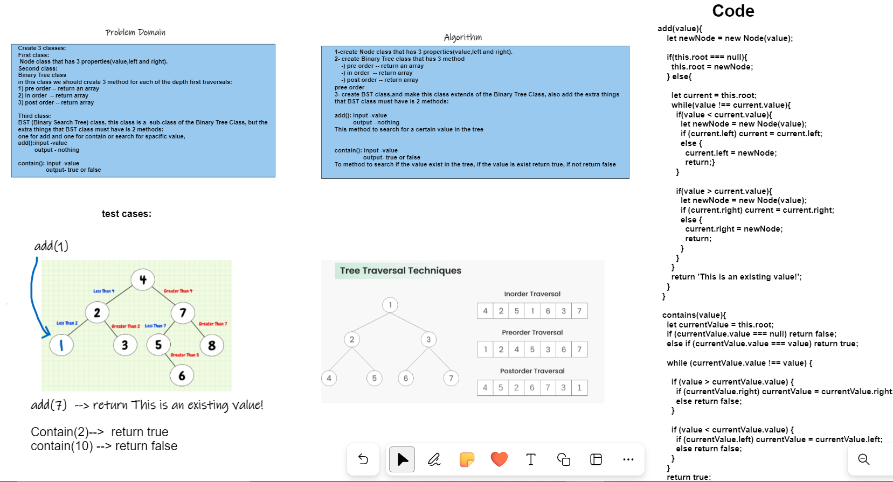
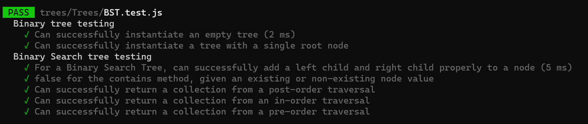

>## 
>## WhiteBoard
>


>## testing:
>


>## code:
>
```class BinarySearchTree extends BinaryTree{
  constructor(){
    super();
  }

  add(value){
    let newNode = new Node(value);

    if(this.root === null){
      this.root = newNode;
    } else{

      let current = this.root;
      while(value !== current.value){
        if(value < current.value){
          let newNode = new Node(value);
          if (current.left) current = current.left;
          else {
            current.left = newNode;
            return;}
        }

        if(value > current.value){
          let newNode = new Node(value);
          if (current.right) current = current.right;
          else {
            current.right = newNode;
            return;
          }
        }
      }
      return 'This is an existing value!';
    }
  }

  contains(value){
    let currentValue = this.root;
    if (currentValue.value === null) return false;
    else if (currentValue.value === value) return true;

    while (currentValue.value !== value) {

      if (value > currentValue.value) {
        if (currentValue.right) currentValue = currentValue.right;
        else return false;
      }

      if (value < currentValue.value) {
        if (currentValue.left) currentValue = currentValue.left;
        else return false;
      }
    }
    return true;
  }```