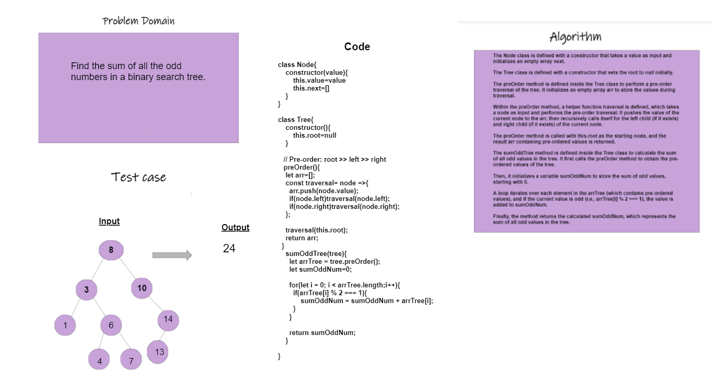

# sum Odd Numbers in Binary Tree

### whiteBoard




code :
```
class Node{
    constructor(value){
        this.value=value
        this.next=[]
    }
}

class Tree{
    constructor(){
        this.root=null
    }

   // Pre-order: root >> left >> right
   preOrder(){
    let arr=[];
    const traversal= node =>{
      arr.push(node.value);
      if(node.left)traversal(node.left);
      if(node.right)traversal(node.right);
    };

    traversal(this.root);
    return arr;
  }
    sumOddTree(tree){
      let arrTree = tree.preOrder();
      let sumOddNum=0;

      for(let i = 0; i < arrTree.length;i++){
        if(arrTree[i] % 2 === 1){
            sumOddNum = sumOddNum + arrTree[i];
        }
      }

      return sumOddNum;
    }
    
}

let tree= new Tree()

let n1 = new Node(21);
let n2 = new Node(44);
let n3 = new Node(55);
let n4 = new Node(89);
let n5 = new Node(99);


tree.root = n1;
n1.left = n2;
n1.right = n3;
n2.left = n4;
n2.right = n5;


console.log(tree.preOrder());

console.log(tree.sumOddTree(tree))


```
